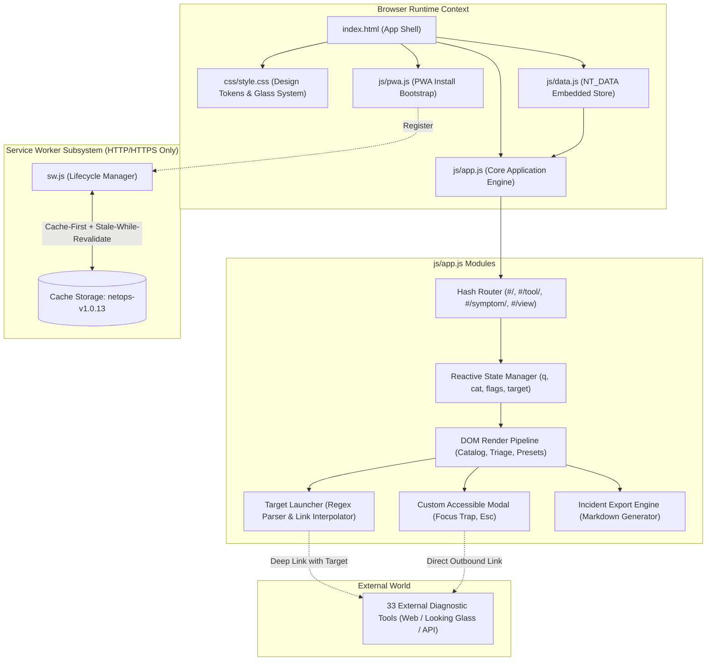
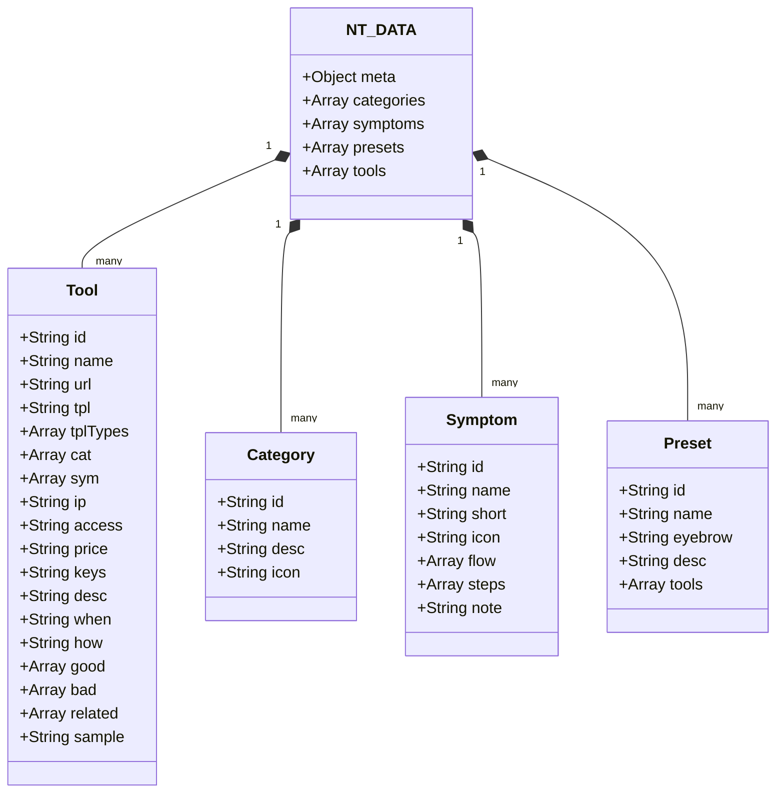
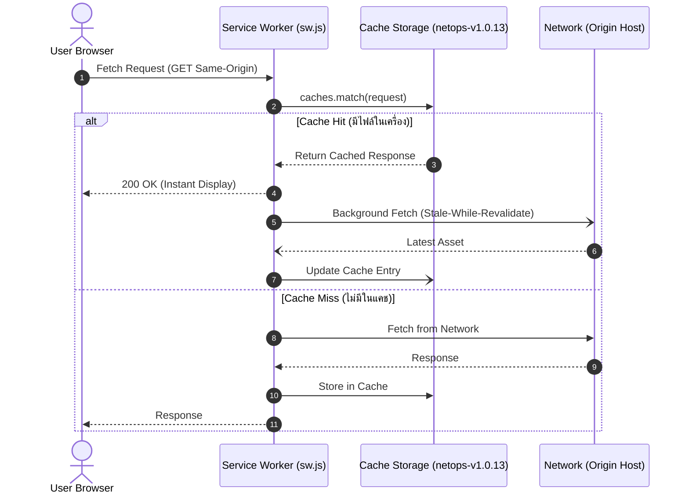

# 🏗️ System Architecture — NetOps Toolkit

> **Document Version**: 1.0.0  
> **System Version**: v1.0.13  
> **Architecture Pattern**: Zero-Dependency Static SPA + Offline-First Service Worker  
> **Conformance**: Dark Glassmorphism Universal Specification (`DESIGN-SYSTEM.md`)

---

## 1. Architectural Tenets (หลักการสถาปัตยกรรม)

NetOps Toolkit ถูกออกแบบภายใต้ข้อจำกัดทางวิศวกรรมที่เข้มงวด 5 ประการ เพื่อให้สามารถทำงานได้ในสภาพแวดล้อมที่หลากหลายที่สุด ตั้งแต่ Local File System ของวิศวกร ไปจนถึง Production CDN:

1. **Zero External Runtime Dependencies**: ไม่พึ่งพา Library, Framework หรือ CDN ภายนอก (No React, No Tailwind, No Font CDN) เพื่อขจัดปัญหา Network Latency, DNS Failure และ Supply Chain Attacks
2. **Strict `file://` Origin Isolation Guarantee**: ต้องสามารถดับเบิลคลิกไฟล์ `index.html` เพื่อเปิดใช้งานจาก Local Disk ได้ทันทีโดยไม่เกิด `SecurityError` หรือ `CORS Origin null` Error
3. **Deterministic Zero-Console Output**: คอนโซลของเบราว์เซอร์ต้องสะอาด 100% (0 error, 0 warning, 0 log) ข้อผิดพลาดทุกจุดต้องมี Graceful Fallback ภายในระบบ
4. **Resilient Offline-First Capabilities**: ทำงานแบบ Offline ได้สมบูรณ์ผ่าน Service Worker Pre-caching เมื่อเสิร์ฟผ่าน HTTP/HTTPS
5. **Decoupled Data & View Architecture**: แยกฐานข้อมูลเครื่องมือและการวิเคราะห์ (`js/data.js`) ออกจากตรรกะการแสดงผล (`js/app.js`) อย่างเด็ดขาด พร้อมชุด Smoke Test ตรวจสอบความถูกต้องโดยอัตโนมัติ

---

## 2. System Topology & Component Diagram

โครงสร้างการทำงานและลำดับการประมวลผลของ NetOps Toolkit:



---

## 3. Data Layer Architecture (`js/data.js`)

ข้อมูลทั้งหมดถูกจัดเก็บเป็น Static Data Store ภายใน `window.NT_DATA` ในรูปแบบ IIFE ที่ไม่มีการส่ง Request ออกภายนอก โครงสร้างประกอบด้วย 5 ส่วนหลัก:



### Data Integrity Rules (บังคับตรวจผ่าน `tests/data.test.js`)
1. ทุก `tool.id`, `category.id`, `symptom.id`, `preset.id` ต้อง Unique 100%
2. ทุก `tool.cat` ต้องอ้างอิง Category ที่มีอยู่จริง (โดย `cat[0]` ถือเป็นหมวดหมู่หลัก)
3. ทุก `tool.sym` ต้องอ้างอิง Symptom ที่มีอยู่จริง
4. ทุก `tool.related` ต้องอ้างอิง Tool ID ที่มีอยู่จริง
5. หากเครื่องมือมี `tpl` จะต้องมี `tplTypes` ที่ระบุชนิดข้อมูล (`domain`, `ipv4`, `ipv6`, `asn`) อย่างถูกต้อง
6. ทุก `symptom.steps` ต้องมีไม่น้อยกว่า 4 ขั้น และอ้างอิง Tool ID ที่มีอยู่จริง

---

## 4. State Management & Hash Routing Engine

### Reactive State Structure
`js/app.js` จัดการ State รวมศูนย์ไว้ใน Object เดียว:

```javascript
var state = {
  q: '',                  // Search query string
  cat: 'all',             // Active category ID ('all' or specific category)
  flags: {
    ipv6: false,          // IPv6 dual-stack support filter
    free: false,          // 100% free tool filter
    tpl: false,           // Deep-link capable tool filter
    api: false            // API / CLI support filter
  },
  preset: null,           // Active preset ID
  target: '',             // Active user target string
  targetType: null,       // Detected type: 'domain' | 'ipv4' | 'ipv6' | 'asn' | null
  checks: {},             // Map of checked steps in playbooks: { 'symId:stepIdx': true }
  currentTool: null       // Tool ID currently open in modal
};
```

### Hash Routing Pattern vs. History API
```
┌────────────────────────────────────────────────────────┐
│                   HASH ROUTING TABLE                   │
├───────────────────────────┬────────────────────────────┤
│ Route Hash                │ Action / View State        │
├───────────────────────────┼────────────────────────────┤
│ #/                        │ Default View (All Open)    │
│ #/tool/:id                │ Open Tool Detail Modal     │
│ #/symptom/:id             │ Open Symptom Playbook      │
│ #/view?q=...&cat=...&t=...│ Restore Filtered View      │
└───────────────────────────┴────────────────────────────┘
```

> ⚠️ **ข้อบังคับด้านความปลอดภัย**: ระบบจงใจ**ห้ามใช้** `history.pushState` หรือ `history.replaceState` เนื่องจากเบราว์เซอร์ตระกูล Chromium จะขว้าง `DOMException: Blocked a frame with origin "null" from accessing a cross-origin frame` ทันทีที่เปิดจาก `file:///` การเปลี่ยนเส้นทางทั้งหมดจึงควบคุมผ่าน `location.hash` และฟังผ่าน Event `hashchange` เท่านั้น

---

## 5. Offline-First Service Worker (`sw.js`)

ระบบ Service Worker ออกแบบมาเพื่อรับประกันการทำงานแบบออฟไลน์ 100% สำหรับการค้นหาและเปิดดู Playbook เมื่ออยู่หน้างาน:



### ขอบเขตการทำงาน (Scope Boundaries)
- **Same-Origin Requests**: นำทางผ่าน Cache-first พร้อมอัปเดตเบื้องหลัง (Stale-while-revalidate)
- **Cross-Origin Requests**: ละเว้นทันที ปล่อยให้เบราว์เซอร์จัดการตรง เพื่อไม่ให้รบกวนการเปิดลิงก์เครื่องมือภายนอก
- **Navigation Fallback**: หากเชื่อมต่ออินเทอร์เน็ตไม่ได้ในโหมด Navigation ให้คืนค่า `./index.html` เสมอ

---

## 6. Design System Implementation (`DESIGN-SYSTEM.md`)

อินเทอร์เฟซสร้างขึ้นตามมาตรฐาน **Dark Glassmorphism Specification**:

1. **3-Layer Depth System**:
   - Layer 1: Base Canvas Gradient (Fixed Background)
   - Layer 2: Independent Ambient Orbs (อนิเมชันความเร็วต่างกัน 26s, 32s, 38s เพื่อเลี่ยงการเกิด Harmonic Pattern)
   - Layer 3: Subtle Dot Grid Mask (`radial-gradient`)
2. **Circular SVG Progress Ring Math**:
   - เส้นรอบวงคำนวณตามสูตรเรขาคณิต:  
     $$C = 2 \times \pi \times r = 2 \times 3.14159 \times 16.5 \approx 103.67\text{ px}$$
   - ควบคุมการแสดงผลความคืบหน้าด้วย:  
     $$\text{stroke-dashoffset} = C - \left(\frac{\text{progress}}{100} \times C\right)$$
3. **3-Alpha Status Rule**:
   - Badges, Chips และ Status Pill ทั้งหมดสร้างขึ้นจากฐานสีเดียว (Base Hue) ด้วยระดับ Alpha ที่กำหนด:
     - Background: Alpha `0.08` – `0.12`
     - Border: Alpha `0.40`
     - Text/Foreground: Alpha `1.00`
4. **Motion Safety Standards**:
   - ทุก Transition และ Animation จะถูกปิดใช้งานทันทีเมื่อระบบตรวจพบ Media Query `prefers-reduced-motion: reduce`

---

## 7. Security, Resilience & Safe Fallback Directives

```
┌────────────────────────────────────────────────────────┐
│             THE 6 ZERO-ERROR DIRECTIVES                │
├────────────────────────────────────────────────────────┤
│ 1. Zero Fetch/XHR      → All data static in data.js    │
│ 2. Zero History API    → 100% Hash-based routing       │
│ 3. Guarded Storage     → Safe try/catch localStorage   │
│ 4. Guarded Clipboard   → navigator.clipboard + execCopy│
│ 5. System Fonts Only   → Zero Google Fonts requests    │
│ 6. Zero Console Calls  → Pure silent error recovery    │
└────────────────────────────────────────────────────────┘
```

1. **Safe Storage**: ทุกการอ่าน/เขียน `localStorage` ถูกห่อหุ้มด้วย Block `try { ... } catch (e) { ... }` อย่างรัดกุม เพื่อป้องกัน Error เมื่อเปิดใน Safari Private Browsing หรือ `file://`
2. **Safe Clipboard API**: การคัดลอก Markdown และ Share Link จะพยายามเรียกใช้ `navigator.clipboard.writeText` เป็นอันดับแรก หากไม่สำเร็จ (เช่น ไม่อยู่ใน Secure Context) จะสลับไปใช้ `document.execCommand('copy')` โดยอัตโนมัติ
3. **Modal Focus Management**: ขณะเปิด Modal ระบบจะดักจับปุ่ม `Tab` เพื่อวนลูป Focus (Focus Trap) และคืนค่า Focus กลับไปยัง Element ต้นทางทันทีเมื่อปิด เพื่อรองรับ Screen Reader และ Keyboard Users

---

## 8. Automated Quality Gate Pipeline

การทดสอบของระบบถูกควบคุมผ่านสคริปต์ Node.js แบบ Zero-Dependency (`tests/data.test.js`) ซึ่งรันการตรวจสอบ 992 ข้อ:

```
[ Developer / CI ] ──> node tests/data.test.js
                             │
                             ├─► 1. Syntax Check (data.js, app.js, pwa.js, sw.js)
                             ├─► 2. Data Integrity (Tools, Cats, Symptoms, Presets)
                             ├─► 3. Cross-Reference Validation (IDs, Related, Tpl)
                             ├─► 4. Version Synchronization (index.html, sw.js, data.js)
                             └─► 5. Cache Manifest File Existence on Disk
```
