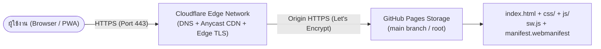

# 🚀 DEPLOY — NetOps Toolkit Production Guide

> **Target Architecture**: GitHub Pages (Static Hosting) + Cloudflare (DNS, Edge SSL/TLS, CDN)  
> **Target Release**: NetOps Toolkit v1.0.14  
> **Key Characteristics**: 100% Static, Zero Build Step, Zero Server-Side Runtime, Full PWA Offline Capability  

---

## 📋 สารบัญ

- [1. สถาปัตยกรรมการเผยแพร่ (Deployment Architecture)](#1-สถาปัตยกรรมการเผยแพร่-deployment-architecture)
- [2. ข้อกำหนดเบื้องต้น (Prerequisites)](#2-ข้อกำหนดเบื้องต้น-prerequisites)
- [3. ขั้นตอนการ Deploy ทีละสเต็ป (Step-by-Step Deployment)](#3-ขั้นตอนการ-deploy-ทีละสเต็ป-step-by-step-deployment)
  - [สเต็ป 1: จัดเตรียมและ Push Git Repository](#สเต็ป-1-จัดเตรียมและ-push-git-repository)
  - [สเต็ป 2: เปิดใช้งาน GitHub Pages](#สเต็ป-2-เปิดใช้งาน-github-pages)
  - [สเต็ป 3: ผูก Custom Domain ผ่าน Cloudflare](#สเต็ป-3-ผูก-custom-domain-ผ่าน-cloudflare)
  - [สเต็ป 4: ลำดับการตั้งค่า TLS/SSL ที่ถูกต้อง](#สเต็ป-4-ลำดับการตั้งค่า-tlsssl-ที่ถูกต้อง)
- [4. การตรวจสอบความสมบูรณ์หลัง Deploy (Post-Deployment Verification)](#4-การตรวจสอบความสมบูรณ์หลัง-deploy-post-deployment-verification)
- [5. วงจรการอัปเดตเวอร์ชัน (Release & Version Lifecycle)](#5-วงจรการอัปเดตเวอร์ชัน-release--version-lifecycle)
- [6. ตารางแก้ปัญหาที่พบบ่อย (Troubleshooting Matrix)](#6-ตารางแก้ปัญหาที่พบบ่อย-troubleshooting-matrix)

---

## 1. สถาปัตยกรรมการเผยแพร่ (Deployment Architecture)

NetOps Toolkit อาศัยการทำงานร่วมกันระหว่าง **Cloudflare** ในระดับ Edge Network และ **GitHub Pages** ในระดับ Storage/Origin Server:



### จุดเด่นของโครงสร้างนี้:
1. **Zero Cost & Maintenance**: ใช้งาน Free Tier ของทั้ง GitHub Pages และ Cloudflare ได้ 100%
2. **Subpath & Root Domain Agnostic**: ไฟล์ทั้งหมดอ้างอิงผ่าน Relative Path (`./js/...`, `./sw.js`) ทำให้ Deploy ได้ทั้งโดเมนหลัก (`https://netops.example.com/`) หรือ Subpath (`https://<username>.github.io/netops-toolkit/`) โดยไม่ต้องแก้ไขโค้ดแม้แต่บรรทัดเดียว
3. **True PWA Offline Support**: เมื่อรันบน HTTPS ที่ถูกต้อง Service Worker จะเปิดการทำงาน Pre-caching และรองรับการติดตั้งแอป (Add to Home Screen / Desktop App) ทันที

---

## 2. ข้อกำหนดเบื้องต้น (Prerequisites)

- บัญชี GitHub (สำหรับสร้าง Repository และเปิด GitHub Pages)
- บัญชี Cloudflare ที่ Add โดเมนไว้เรียบร้อยแล้ว (Nameservers ชี้ไปที่ Cloudflare)
- Node.js ติดตั้งในเครื่องสำหรับรัน Smoke Test ตรวจสอบก่อน Push

---

## 3. ขั้นตอนการ Deploy ทีละสเต็ป (Step-by-Step Deployment)

### สเต็ป 1: จัดเตรียมและ Push Git Repository

เปิด Terminal ในโฟลเดอร์โปรเจกต์ `nw_online_tools`:

```bash
# ตรวจสอบความถูกต้องของข้อมูลและเวอร์ชันก่อน Push
node tests/data.test.js

# เริ่มต้น Git และ Commit ไฟล์
git init
git add index.html css/ js/ icons/ manifest.webmanifest sw.js tests/
git add README.md DEPLOY.md DESIGN-SYSTEM.md PRD.md ARCHITECTURE.md HANDOFF.md
git commit -m "Release NetOps Toolkit v1.0.14"

# สร้าง Branch main และเชื่อมต่อ Remote Repo
git branch -M main
git remote add origin https://github.com/<USERNAME>/netops-toolkit.git
git push -u origin main
```

> 💡 **ข้อแนะนำ `.nojekyll`**: GitHub Pages จะรัน Jekyll อัตโนมัติหากไม่พบไฟล์ `.nojekyll` แม้โปรเจกต์นี้จะไม่มีโฟลเดอร์ที่ขึ้นต้นด้วย Underscore แต่แนะนำให้สร้างไฟล์เปล่าชื่อ `.nojekyll` ไว้ที่ Root เพื่อปิดกระบวนการประมวลผลของ Jekyll ให้ Deploy ได้เร็วขึ้น:
> ```bash
> touch .nojekyll && git add .nojekyll && git commit -m "Disable Jekyll engine" && git push
> ```

---

### สเต็ป 2: เปิดใช้งาน GitHub Pages

1. ไปที่ Repository บน GitHub → คลิกเมนู **Settings**
2. เลือกแท็บ **Pages** (แถบเมนูด้านซ้าย)
3. ภายใต้หัวข้อ **Build and deployment**:
   - **Source**: เลือก `Deploy from a branch`
   - **Branch**: เลือก `main` และโฟลเดอร์ `/ (root)`
   - คลิกปุ่ม **Save**
4. รอระบบ GitHub Actions ดำเนินการ Build ประมาณ 1–2 นาที จะได้รับ URL เริ่มต้น:  
   `https://<USERNAME>.github.io/netops-toolkit/`
5. เข้าไปทดสอบที่ URL ดังกล่าว ตรวจสอบว่าหน้าเว็บแสดงผลปกติและคอนโซลไม่มี Error

---

### สเต็ป 3: ผูก Custom Domain ผ่าน Cloudflare

สมมติว่าต้องการผูกโดเมน `netops.example.com` หรือ Apex Domain `example.com`:

#### 3.1 กำหนด Custom Domain บน GitHub Pages
1. ในหน้า **Settings → Pages** บน GitHub
2. กรอกโดเมนที่ต้องการในช่อง **Custom domain** (เช่น `netops.example.com` หรือ `example.com`) → กด **Save**
3. ระบบจะสร้างไฟล์ `CNAME` ให้ใน Repository โดยอัตโนมัติ

#### 3.2 ตั้งค่า DNS Records ใน Cloudflare Dashboard
ไปที่ **Cloudflare Dashboard → โดเมนของคุณ → DNS → Records** และเพิ่ม Record ตามตาราง:

| Record Type | Name | Content / Target | Proxy Status | หมายเหตุ |
|---|---|---|---|---|
| `CNAME` | `netops` (หรือ `www`) | `<USERNAME>.github.io` | ⚪ **DNS Only (ปิดส้ม)** | **ต้องปิด Proxy ก่อนในขั้นแรก!** |
| `CNAME` | `@` (Root Apex) | `<USERNAME>.github.io` | ⚪ **DNS Only (ปิดส้ม)** | Cloudflare รองรับ CNAME Flattening ที่ Root |

---

### สเต็ป 4: ลำดับการตั้งค่า TLS/SSL ที่ถูกต้อง (สำคัญที่สุด)

GitHub Pages จะออกใบรับรอง SSL/TLS (Let's Encrypt Certificate) ให้กับโดเมนของคุณโดยการ Verify ผ่าน DNS/HTTP challenge ของโดเมนจริง **หากเปิด Cloudflare Proxy (ก้อนเมฆสีส้ม) ก่อนที่ใบรับรองจะออกสำเร็จ การตรวจสอบจะล้มเหลว**:

```
[ ลำดับขั้นตอนการออก Certificate ที่ถูกต้อง ]
1. ตั้ง DNS Record เป็น ⚪ DNS-only (สีเทา) ทั้งหมด
        │
        ▼
2. รอ 5–20 นาที จนกว่าหน้า GitHub Pages Settings ขึ้น "DNS check successful"
        │
        ▼
3. ติ๊กเปิด ✅ "Enforce HTTPS" ในหน้า GitHub Pages
        │
        ▼
4. ทดสอบเข้า https://<domain> ตรง ๆ และพบว่ามีกุญแจเขียว (Let's Encrypt cert)
        │
        ▼
5. สลับ Cloudflare DNS Records เป็น 🟠 Proxied (เปิดก้อนเมฆสีส้ม)
        │
        ▼
6. ตั้งค่า Cloudflare SSL/TLS Mode เป็น "Full" หรือ "Full (strict)"
```

> ⚠️ **คำเตือนเรื่อง SSL Mode**: ใน Cloudflare **ห้ามเลือก SSL Mode เป็น `Flexible` เด็ดขาด** เพราะจะทำให้เกิดปัญหา **ERR_TOO_MANY_REDIRECTS** (Infinite Redirect Loop) และทำให้ Service Worker ไม่สามารถแคชไฟล์ได้ ให้ตั้งเป็น `Full` หรือ `Full (strict)` เสมอ

#### การตั้งค่าเสริมที่แนะนำบน Cloudflare:
- **Always Use HTTPS**: `SSL/TLS → Edge Certificates` → เปิดใช้งาน (ON)
- **Minimum TLS Version**: `TLS 1.2` หรือสูงกว่า
- **Browser Cache TTL**: `Respect Existing Headers` (เพื่อให้แคชอิงตาม Header ของ GitHub Pages)

---

## 4. การตรวจสอบความสมบูรณ์หลัง Deploy (Post-Deployment Verification)

เปิดเบราว์เซอร์ไปที่โดเมนจริงของคุณ (เช่น `https://netops.example.com`) และทำการตรวจสอบตามลำดับ:

1. **Console Check**: เปิด DevTools (F12) → แถบ **Console** ต้องสะอาด 100% (ไม่มี Error สีแดงแม้แต่บรรทัดเดียว)
2. **Service Worker State**: แถบ **Application → Service Workers**
   - ตรวจสอบว่า Status แสดงเป็น **`activated and is running`**
   - Scope ต้องตรงกับ Base URL ของเว็บ
3. **Cache Storage**: แถบ **Application → Cache Storage**
   - ต้องพบ Cache ชื่อ **`netops-v1.0.14`**
   - บรรจุไฟล์ครบทั้ง 8 รายการ ได้แก่ `./`, `./index.html`, `./css/style.css?v=1.0.14`, `./js/data.js?v=1.0.14`, `./js/app.js?v=1.0.14`, `./js/pwa.js?v=1.0.14`, `./manifest.webmanifest`, `./icons/icon.svg`
4. **Offline Capability Test**:
   - ใน DevTools ไปที่แถบ **Network** → ติ๊กเลือก **Offline**
   - กดปุ่ม Reload หน้าเว็บ (Ctrl+R หรือ F5)
   - หน้าเว็บต้องแสดงผลได้ครบถ้วน สามารถค้นหาเครื่องมือ เปิด Playbook และคัดลอก Markdown ได้ตามปกติ
5. **PWA Install Prompt**:
   - บนเบราว์เซอร์ Chrome/Edge ที่รองรับ จะต้องพบปุ่ม **"ติดตั้งแอป"** ปรากฏในเมนูหลัก หรือมีไอคอน Install ปรากฏบน Address Bar

---

## 5. วงจรการอัปเดตเวอร์ชัน (Release & Version Lifecycle)

เมื่อมีการแก้ไขไฟล์ CSS, JS หรือข้อมูลใน `js/data.js` ในอนาคต ให้ปฏิบัติตามรอบการปล่อยเวอร์ชันดังนี้:

```bash
# 1. ปรับปรุงหมายเลขเวอร์ชันให้ตรงกัน 3 จุดเสมอ:
#    - index.html  : แก้ไข ?v=x.x.x ทุกจุด
#    - sw.js       : แก้ไข CACHE = 'netops-vx.x.x' และ asset ใน SHELL
#    - js/data.js  : แก้ไข meta.version = 'x.x.x'

# 2. รัน Smoke Test ตรวจจับข้อผิดพลาด
node tests/data.test.js

# 3. Commit และ Push ขึ้น GitHub
git add -A
git commit -m "Release v1.0.14: Updated BGP diagnostic tools"
git push origin main
```

- GitHub Pages จะเริ่ม Build ใหม่และอัปเดตไฟล์ขึ้น Production ภายใน 60 วินาที
- เบราว์เซอร์ของผู้ใช้จะดาวน์โหลด Service Worker ใหม่ในพื้นหลัง และอัปเดตไฟล์ให้สมบูรณ์เมื่อผู้ใช้เปิดเว็บหรือรีเฟรชครั้งถัดไป (Stale-While-Revalidate)

---

## 6. ตารางแก้ปัญหาที่พบบ่อย (Troubleshooting Matrix)

| อาการปัญหาที่พบ | สาเหตุที่เป็นไปได้ | แนวทางแก้ไข |
|---|---|---|
| เข้า URL แล้วขึ้น **404 Not Found** ของ GitHub | GitHub Pages ยัง Build ไม่เสร็จ หรือตั้งค่า Branch ผิด | ไปที่ Repo Settings → Pages ตรวจสอบสถานะการ Build และยืนยันว่า Branch ชี้ไปที่ `main` โฟลเดอร์ `/ (root)` |
| หน้าเว็บโหลดได้แต่ CSS/JS ไม่ทำงาน (404) | Jekyll ข้ามไฟล์ หรือเขียน Relative Path ผิด | สร้างไฟล์ `.nojekyll` ไว้ที่ Root ของ Repository และตรวจสอบว่า Path ใน HTML ใช้ `./css/...` |
| เกิดปัญหา **ERR_TOO_MANY_REDIRECTS** วนลูปไม่จบ | Cloudflare SSL/TLS ถูกตั้งไว้ที่โหมด `Flexible` | ไปที่ Cloudflare → SSL/TLS Overview → เปลี่ยนโหมดเป็น **`Full`** หรือ **`Full (strict)`** |
| Certificate ผิดพลาด / แจ้งเตือน Unsecured | เปิด Cloudflare Proxy ก่อนที่ GitHub จะออก Certificate เสร็จ | ปรับ DNS ใน Cloudflare กลับเป็น **DNS Only (สีเทา)** รอจนกว่า GitHub จะออก Cert แล้วจึงค่อยเปิดส้ม |
| Service Worker ไม่ลงทะเบียน (`sw.js` fail) | เว็บไม่ได้เปิดผ่าน HTTPS หรือเปิดผ่าน `http://` | ตรวจสอบว่าเปิดผ่าน HTTPS อย่างสมบูรณ์ (Service Worker ปฏิเสธการทำงานบน HTTP ธรรมดา ยกเว้น localhost) |
| ผู้ใช้งานยังคงเห็นเวอร์ชันเก่า ไม่ยอมอัปเดต | ลืม Bump เวอร์ชันใน `?v=` หรือแคช SW เก่ายังค้าง | ตรวจสอบ Version Triad ทั้ง 3 จุดให้ตรงกัน และแจ้งให้ผู้ใช้ Refresh ซ้ำ 2 ครั้งตามพฤติกรรมของ Stale-While-Revalidate |
| ปุ่ม "ติดตั้งแอป" ไม่ยอมแสดงบนเดสก์ท็อป | เบราว์เซอร์ตรวจไม่พบ Manifest หรือยังไม่มีการ Interaction | ตรวจสอบแถบ DevTools → Application → Manifest ว่าอ่านค่า JSON ได้ถูกต้อง และคลิกบนหน้าเว็บก่อน 1 ครั้ง |
